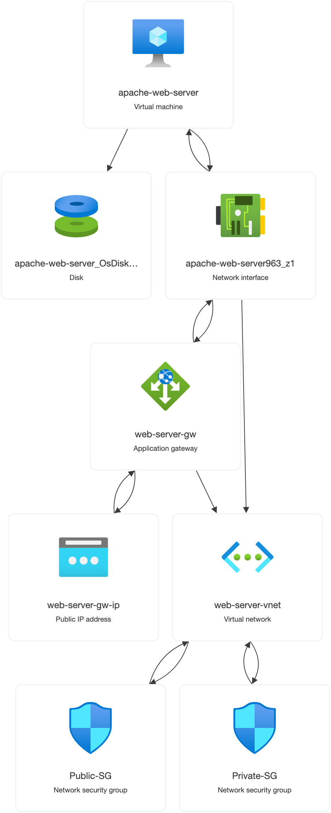
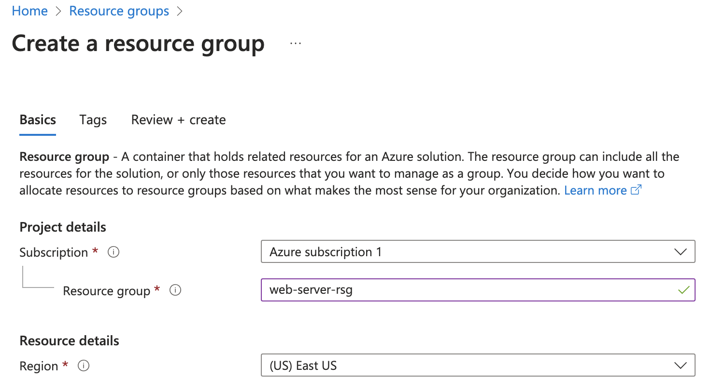
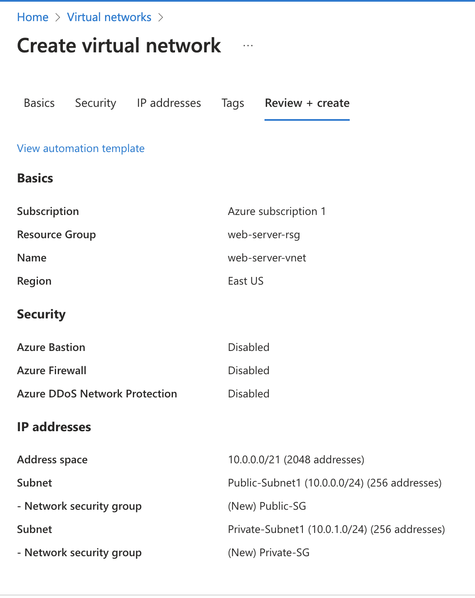
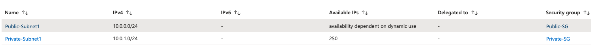
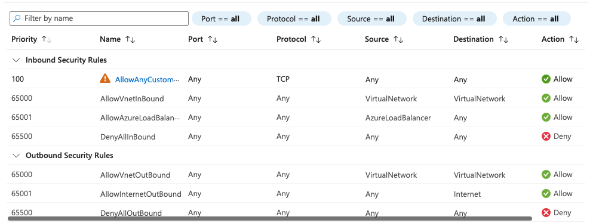
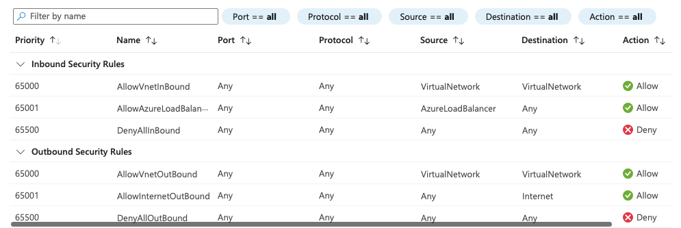

# Azure Networking and Virtual Machines running web servers
*Azure virtual networking end-to-end and virtual machines*




### Create a Resource Group
> Logical grouping of resources provisioned in Azure (allows for management and deletion of multiple resources at the same time)



### Create a Virtual Network (VNET)
> Emulation of physical networking and a logically isolated section in Azure, VNets can be further Segmented using Subnets and protected using Network Security Group(NSG)



### Create Subnet
Create two subnets; one public subnet for the Application Gateway and one private subnet for the webserver virtual machine 




### Create a Network Security Group (NSG)
Used for network filtering at the subnet level and VM level, acts as a gatekeeper for Subnets, Defines who can connect in and out of subnet
Create a Public NSG and associate it with the Public Subnet, allowing all HTTP/S traffic on ports 443/80 into the subnet and then create another Private NSG, associate it with the Private Subnet, Blocking all traffic from the internet.

> Public NSG Inbound/Outbound Security Rules



> Private NSG Inbound/Outbound rules



### Create a Virtual Machine (VM)
Create a VM in the Private Subnet without internet access, a public IP address shouldn't be assigned to the VM. Only the Application Gateway should be allowed to have access to it. 

> [!NOTE]
> Add the code below to the User data script to install the Apache server at boot time.

```
#!/bin/bash
sudo apt-get update -y
sudo apt-get install apache2 -y
sudo ufw allow 'Apache'
sudo systemctl enable apache2

sudo cat > ~/index.html << EOF
<h1>We are Live on Azure Cloud</h1> 
EOF

sudo mv ~/index.html /var/www/html
sudo systemctl restart apache2

```

### Create an Application Gateway
> Traffic distribution for HTTP (web) traffic (Layer 7), offering various traffic routing rules and SSL termination.
>> This should be created in a Subset that allows for public traffic (Public Subnet).

Application Gateway 5 main configurations:

Backend pools (This represents the VMs the Application Gateway will send traffic to)
HTTP settings (Settings for the incoming HTTP Requests)
Frontend IP Configurations (The public IP exposed by the Application Gateway)
Listeners (Receives requests on a specific port and protocol)
Rules (rules connecting Listener with Backend pool)


